# 自动驾驶数据闭环系统软件架构与详细设计文档

## 1. 引言

### 1.1 文档目的

本文档旨在详细描述自动驾驶数据闭环系统的软件架构和设计，涵盖系统的整体架构、模块划分、接口设计、数据流以及关键实现细节。该文档面向系统设计人员、开发人员和测试人员，为他们提供系统实现的详细指导。

### 1.2 系统概述

自动驾驶数据闭环系统是一个集成的数据采集、处理、分析和优化系统，旨在通过闭环反馈机制优化自动驾驶车辆的数据采集策略和路径规划算法。系统主要包括以下几个核心模块：

1. **数据采集模块** - 负责实际的数据采集工作
2. **导航规划模块** - 负责路径规划和导航决策
3. **状态机模块** - 协调各模块的工作流程
4. **数据处理与分析模块** - 分析采集的数据并优化系统参数

### 1.3 术语和缩写

| 术语 | 说明 |
|------|------|
| AD | Autonomous Driving (自动驾驶) |
| DCL | Data Closed Loop (数据闭环) |
| ROI | Region of Interest (感兴趣区域) |
| RL | Reinforcement Learning (强化学习) |
| PPO | Proximal Policy Optimization (近端策略优化) |
| DCP | Data Collection as Planning (数据采集规划器) |

## 2. 系统架构设计

### 2.1 整体架构

系统采用模块化设计，主要分为以下几个层次：

1. **应用层** - 包含主控制器和状态机
2. **核心功能层** - 包含数据采集、导航规划等核心功能模块
3. **工具层** - 包含日志、配置管理等通用工具
4. **接口层** - 提供与外部系统的接口


### 2.2 模块划分

#### 2.2.1 主要模块

1. **DataCollectionPlanner** - 数据采集规划器，作为系统的主控制器
2. **NavPlannerNode** - 导航规划节点，负责路径规划和导航决策
3. **StateMachine** - 状态机，协调各模块的工作流程
4. **DataStorage** - 数据存储模块
5. **DataUploader** - 数据上传模块
6. **TriggerManager** - 触发管理模块
7. **StrategyParser** - 策略解析模块

#### 2.2.2 辅助模块

1. **CostMap** - 成本地图管理
2. **RoutePlanner** - 路径规划器
3. **SamplingOptimizer** - 采样优化器
4. **SemanticMap** - 语义地图
5. **SemanticConstraintChecker** - 语义约束检查器
6. **CoverageMetric** - 覆盖率度量
7. **RewardCalculator** - 奖励计算器
8. **DataCollectionAnalyzer** - 数据分析器

### 2.3 数据流设计

系统数据流主要包括以下几个阶段：

1. **初始化阶段** - 各模块初始化和配置加载
2. **任务规划阶段** - 根据任务区域规划最优路径
3. **执行采集阶段** - 沿路径执行数据采集
4. **反馈优化阶段** - 分析采集数据并优化系统参数
5. **数据上传阶段** - 将采集的数据上传至云端

```mermaid
classDiagram
    class DataCollectionPlanner {
        - nav_planner_ : unique_ptr<NavPlannerNode>
        - data_storage_ : unique_ptr<DataStorage>
        - data_uploader_ : unique_ptr<DataUploader>
        - trigger_manager_ : unique_ptr<TriggerManager>
        - strategy_parser_ : unique_ptr<StrategyParser>
        - collected_data_ : vector<DataPoint>
        - mission_area_ : MissionArea>
        + DataCollectionPlanner(config_file: string)
        + initialize() : bool
        + setMissionArea(area: MissionArea) : void
        + planDataCollectionMission() : vector<Point>
        + executeDataCollection(path: vector<Point>) : void
        + updateWithNewData(new_data: vector<DataPoint>) : void
        + reportCoverageMetrics() : void
        + analyzeAndExportWeights() : void
        + uploadCollectedData() : void
        + getCollectedData() : const vector<DataPoint>&
    }
    
    class NavPlannerNode {
        - costmap_ : unique_ptr<CostMap>
        - route_optimize_ : unique_ptr<PlannerRouteOptimize>
        - sampling_optimizer_ : unique_ptr<SamplingOptimizer>
        - semantic_map_ : unique_ptr<SemanticMap>
        - constraint_checker_ : unique_ptr<SemanticConstraintChecker>
        - semantic_filter_ : unique_ptr<SemanticFilter>
        - coverage_metric_ : unique_ptr<CoverageMetric>
        - config_file_path_ : string
        - planner_parameters_ : map<string, double>
        - current_position_ : Point
        - goal_position_ : Point
        - global_path_ : vector<Point>
        - local_path_ : vector<Point>
        - collected_data_points_ : vector<Point>
        + NavPlannerNode(config_file: string)
        + initialize() : bool
        + loadConfiguration() : bool
        + updateCostmapWithStatistics() : void
        + planGlobalPath() : vector<Point>
        + planLocalPath() : vector<Point>
        + optimizeNextWaypoint() : Point
        + validatePath(path: vector<Point>) : bool
        + updateCoverageMetrics(visited_cells: vector<pair<int,int>>) : void
        + computeStateReward(prev_state_info: StateInfo, new_state_info: StateInfo) : double
        + reloadConfiguration() : void
        + addDataPoint(point: Point) : void
        + setUsePPO(use_ppo: bool) : void
        + loadPPOWeights(filepath: string) : bool
        + savePPOWeights(filepath: string) : bool
        + getCoverageMetric() : const CoverageMetric&
        + getCurrentPosition() : const Point&
        + setCurrentPosition(position: Point) : void
        + getGoalPosition() : const Point&
        + setGoalPosition(position: Point) : void
        + getGlobalPath() : const vector<Point>&
        + getLocalPath() : const vector<Point>&
    }
    
    class CostMap {
        - cells : vector<vector<Cell>>
        - width : int
        - height : int
        - resolution : double
        - sparse_threshold : double
        - exploration_bonus : double
        - redundancy_penalty : double
        + CostMap(width: int, height: int, resolution: double)
        + setParameters(sparse_threshold: double, exploration_bonus: double, redundancy_penalty: double) : void
        + updateWithDataStatistics(data_points: vector<Point>) : void
        + adjustCostsBasedOnDensity() : void
        + getDataDensity(x: int, y: int) : double
        + setCellCost(x: int, y: int, cost: double) : void
        + getCellCost(x: int, y: int) : double
        + isValidCell(x: int, y: int) : bool
        + getWidth() : int
        + getHeight() : int
        + getResolution() : double
        + getSparseThreshold() : double
        + getExplorationBonus() : double
        + getRedundancyPenalty() : double
    }
    
    class Cell {
        + x : int
        + y : int
        + cost : double
        + data_density : double
        + Cell(x: int, y: int, cost: double, density: double)
    }
    
    class Point {
        + x : double
        + y : double
        + Point(x: double, y: double)
    }
    
    class PlannerRouteOptimize {
        + PlannerRouteOptimize(sparse_threshold: double, exploration_bonus: double, redundancy_penalty: double)
        + computeAStarPath(costmap: CostMap, start: Point, goal: Point) : vector<Point>
    }
    
    class SamplingOptimizer {
        - params : SamplingParams
        - coverage_metric : CoverageMetric
        + SamplingOptimizer(parameters: SamplingParams)
        + optimizeNextSample(costmap: CostMap, current_position: Point) : Point
        + calculateSamplingScore(costmap: CostMap, x: int, y: int, current_x: int, current_y: int) : double
        + findNearestSparseCell(costmap: CostMap, current_position: Point) : Point
        + updateParameters(new_params: SamplingParams) : void
        + getCoverageMetric() : const CoverageMetric&
    }
    
    class SamplingParams {
        + exploration_weight : double
        + efficiency_weight : double
        + redundancy_penalty : double
        + sparse_threshold : double
        + SamplingParams()
    }
    
    class SemanticMap {
        - objects : vector<SemanticObject>
        - width : int
        - height : int
        - resolution : double
        + SemanticMap(w: int, h: int, res: double)
        + addObject(obj: SemanticObject) : void
        + removeObject(obj: SemanticObject) : void
        + getObjectsByType(type: SemanticType) : vector<SemanticObject>
        + getObjectsInRadius(center: Point, radius: double) : vector<SemanticObject>
        + isInSemanticRegion(point: Point, type: SemanticType) : bool
        + getSemanticCost(position: Point) : double
        + updateMap(new_objects: vector<SemanticObject>) : void
        + clear() : void
        + getWidth() : int
        + getHeight() : int
        + getResolution() : double
        + getObjectCount() : size_t
    }
    
    class SemanticObject {
        + type : SemanticType
        + position : Point
        + radius : double
        + label : string
        + confidence : double
        + SemanticObject(t: SemanticType, p: Point, r: double, l: string, conf: double)
    }
    
    class SemanticType {
        <<enumeration>>
        ROAD
        LANE_MARKER
        TRAFFIC_SIGN
        TRAFFIC_LIGHT
        PEDESTRIAN_CROSSING
        PARKING_SPOT
        BUILDING
        VEGETATION
        DATA_COLLECTION_ZONE
        UNKNOWN
    }
    
    class SemanticConstraintChecker {
        - semantic_map : SemanticMap
        + SemanticConstraintChecker(map: SemanticMap)
        + checkPathConstraints(path: vector<Point>) : vector<ConstraintViolation>
        + checkPointConstraints(point: Point) : vector<ConstraintViolation>
        + checkTrafficRules(point: Point) : vector<ConstraintViolation>
        + checkDataCollectionConstraints(point: Point) : vector<ConstraintViolation>
        + applyConstraintsToCostmap(costmap: CostMap) : void
        + getConstraintPenalty(point: Point) : double
    }
    
    class ConstraintViolation {
        + object : SemanticObject
        + violation_point : Point
        + description : string
        + severity : double
        + ConstraintViolation(obj: SemanticObject, point: Point, desc: string, sev: double)
    }
    
    class CoverageMetric {
        - total_cells : int
        - visited_cells : int
        - total_sparse_cells : int
        - visited_sparse_cells : int
        - sparse_threshold : double
        + CoverageMetric(sparse_threshold: double)
        + updateCoverage(costmap: CostMap, visited_cells_list: vector<pair<int,int>>) : void
        + getCoverageRatio() : double
        + getSparseCoverageRatio() : double
        + getTotalCells() : int
        + getVisitedCells() : int
        + getTotalSparseCells() : int
        + getVisitedSparseCells() : int
        + reset() : void
    }
    
    class StateInfo {
        + visited_new_sparse : bool
        + trigger_success : bool
        + collision : bool
        + distance_to_sparse : double
        + StateInfo()
    }
    
    class RewardCalculator {
        + computeReward(prev_state_info: StateInfo, new_state_info: StateInfo) : double
        + computeShapedReward(distance_to_sparse: double) : double
    }
    
    class DataCollectionAnalyzer {
        + computeDensityMap(data_points: vector<DataPoint>, grid_width: int, grid_height: int, resolution: double) : Heatmap
        + detectSparseRegions(heatmap: Heatmap, sparse_threshold: double) : vector<Region>
        + adjustCostWeights(sparse_zones: vector<Region>, current_weights: PlannerWeights) : PlannerWeights
        + saveToPlannerConfig(weights: PlannerWeights, config_path: string) : void
    }
    
    class DataPoint {
        + position : Point
        + sensor_data : string
        + timestamp : double
        + DataPoint(pos: Point, data: string, time: double)
    }
    
    class MissionArea {
        + center : Point
        + radius : double
        + MissionArea(c: Point, r: double)
    }
    
    class DataStorage {
        <<abstract>>
        + initialize() : bool
        + collectSensorData(position: Point) : string
        + storeData(data: DataPoint) : void
    }
    
    class DataUploader {
        <<abstract>>
        + initialize() : bool
        + uploadData(data: vector<DataPoint>) : bool
    }
    
    class TriggerManager {
        <<abstract>>
        + initialize() : bool
        + shouldTrigger(position: Point) : bool
        + isInSparseArea(position: Point) : bool
        + getDistanceToNearestSparseArea(position: Point) : double
    }
    
    class StrategyParser {
        <<abstract>>
        + loadConfig(config_path: string) : bool
    }
    
    class Heatmap {
        + density_values : vector<vector<double>>
        + width : int
        + height : int
        + resolution : double
        + Heatmap(w: int, h: int, res: double)
    }
    
    class Region {
        + center : Point
        + radius : double
        + is_sparse : bool
        + Region(c: Point, r: double, sparse: bool)
    }
    
    class PlannerWeights {
        + sparse_threshold : double
        + exploration_bonus : double
        + redundancy_penalty : double
        + grid_resolution : double
        + PlannerWeights(threshold: double, bonus: double, penalty: double, resolution: double)
    }
    
    class MapData {
        + costmap : CostMap
        + MapData(width: int, height: int, resolution: double)
        + toCostMap() : CostMap
    }
    
    class DataStats {
        + density_map : vector<vector<double>>
        + width : int
        + height : int
        + DataStats(width: int, height: int)
        + dataDensity(position: Point) : double
    }
    
    %% RL Training System Classes
    class PPOAgent {
        - config_ : PPOConfig
        - actor_network_ : vector<vector<double>>
        - critic_network_ : vector<vector<double>>
        - state_dim_ : int
        - hidden_dim_ : int
        - action_dim_ : int
        - total_reward_ : double
        - episode_count_ : int
        + PPOAgent(config: PPOConfig)
        + selectAction(state: Point, deterministic: bool) : int
        + getActionProbabilities(state: Point) : vector<double>
        + getValue(state: Point) : double
        + update(trajectories: vector<Trajectory>) : void
        + saveWeights(filepath: string) : bool
        + loadWeights(filepath: string) : bool
        + getTotalReward() : double
        + getEpisodeCount() : int
        + resetStatistics() : void
    }
    
    class PPOConfig {
        + learning_rate : double
        + gamma : double
        + lam : double
        + clip_epsilon : double
        + entropy_coef : double
        + value_loss_coef : double
        + batch_size : int
        + epochs : int
        + PPOConfig()
    }
    
    class Trajectory {
        + states : vector<Point>
        + actions : vector<int>
        + rewards : vector<double>
        + log_probs : vector<double>
        + values : vector<double>
        + dones : vector<bool>
    }
    
    class State {
        - position : Point
        - distance_to_goal : double
        + State(position: Point)
    }
    
    class NeuralNetwork {
        - layers : vector<Layer>
        - input_dim : int
        - output_dim : int
        - hidden_dim : int
        + NeuralNetwork(input_dim: int, output_dim: int, hidden_dim: int)
        + forward(input: Tensor) : Tensor
        + getParameters() : vector<Tensor>
        + setParameters(params: vector<Tensor>) : void
    }
    
    class TrainingStats {
        - episode_reward : double
        - episode_length : int
        - loss : double
        - success : bool
        + TrainingStats()
    }
    
    class EvaluationResult {
        - avg_reward : double
        - success_rate : double
        - avg_length : double
        - action_distribution : vector<double>
        + EvaluationResult()
    }
    
    DataCollectionPlanner --> NavPlannerNode : uses
    DataCollectionPlanner --> DataStorage : uses
    DataCollectionPlanner --> DataUploader : uses
    DataCollectionPlanner --> TriggerManager : uses
    DataCollectionPlanner --> StrategyParser : uses
    DataCollectionPlanner --> DataPoint : contains
    DataCollectionPlanner --> MissionArea : contains
    DataCollectionPlanner --> DataCollectionAnalyzer : uses
    
    NavPlannerNode --> CostMap : contains
    NavPlannerNode --> PlannerRouteOptimize : contains
    NavPlannerNode --> SamplingOptimizer : contains
    NavPlannerNode --> SemanticMap : contains
    NavPlannerNode --> SemanticConstraintChecker : contains
    NavPlannerNode --> CoverageMetric : contains
    NavPlannerNode --> Point : contains
    NavPlannerNode --> StateInfo : uses
    
    CostMap --> Cell : contains
    CostMap --> Point : uses
    
    RoutePlanner --> CostMap : uses
    RoutePlanner --> Point : uses
    RoutePlanner --> MapData : uses
    RoutePlanner --> DataStats : uses
    
    SamplingOptimizer --> CostMap : uses
    SamplingOptimizer --> Point : uses
    SamplingOptimizer --> SamplingParams : contains
    SamplingOptimizer --> CoverageMetric : contains
    
    SemanticMap --> SemanticObject : contains
    SemanticMap --> Point : uses
    SemanticMap --> SemanticType : uses
    
    SemanticConstraintChecker --> SemanticMap : uses
    SemanticConstraintChecker --> CostMap : uses
    SemanticConstraintChecker --> Point : uses
    SemanticConstraintChecker --> ConstraintViolation : creates
    SemanticConstraintChecker --> SemanticObject : uses
    
    CoverageMetric --> CostMap : uses
    
    RewardCalculator --> StateInfo : uses
    
    DataCollectionAnalyzer --> DataPoint : uses
    DataCollectionAnalyzer --> Heatmap : creates
    DataCollectionAnalyzer --> Region : creates
    DataCollectionAnalyzer --> PlannerWeights : uses
    
    MapData --> CostMap : contains
    DataStats --> Point : uses
    
    %% RL System relationships
    NavPlannerNode --> PPOAgent : uses
    
    PPOAgent --> PPOConfig : contains
    PPOAgent --> Trajectory : uses
    PPOAgent --> Point : uses
```    




## 3. 详细设计

### 3.1 状态机设计

状态机是系统的核心协调组件，负责管理系统的不同状态和状态转换。

#### 3.1.1 状态定义

1. **INITIALIZING** - 系统初始化中
2. **IDLE** - 空闲状态，等待任务指令
3. **PLANNING** - 路径规划中
4. **NAVIGATING** - 导航中，移动到下一个路径点
5. **DATA_COLLECTION** - 数据采集中
6. **UPLOADING** - 数据上传中
7. **ERROR** - 错误状态
8. **SHUTTING_DOWN** - 系统关闭中

#### 3.1.2 事件定义

1. **INIT_COMPLETE** - 初始化完成
2. **PLAN_REQUEST** - 请求路径规划
3. **PLAN_COMPLETE** - 路径规划完成
4. **NAVIGATION_START** - 开始导航
5. **WAYPOINT_REACHED** - 到达路径点
6. **TRIGGER_CONDITION** - 触发条件满足
7. **DATA_COLLECTED** - 数据采集完成
8. **UPLOAD_REQUEST** - 请求数据上传
9. **UPLOAD_COMPLETE** - 数据上传完成
10. **ERROR_OCCURRED** - 发生错误
11. **RECOVERY_REQUEST** - 请求恢复
12. **SHUTDOWN_REQUEST** - 请求关闭

#### 3.1.3 状态转换图


### 3.2 数据采集模块设计

#### 3.2.1 DataCollectionPlanner

作为系统的主控制器，DataCollectionPlanner负责协调导航规划和数据采集工作。

**主要功能**：
1. 初始化各子模块
2. 设置任务区域
3. 规划数据采集任务
4. 执行数据采集
5. 更新系统状态
6. 报告覆盖率指标
7. 分析并导出权重
8. 上传采集的数据

**接口设计**：
```cpp
class DataCollectionPlanner {
private:
    std::unique_ptr<NavPlannerNode> nav_planner_;
    std::unique_ptr<DataStorage> data_storage_;
    std::unique_ptr<DataUploader> data_uploader_;
    std::unique_ptr<TriggerManager> trigger_manager_;
    std::unique_ptr<StrategyParser> strategy_parser_;
    
    std::vector<DataPoint> collected_data_;
    MissionArea mission_area_;
    
public:
    DataCollectionPlanner(const std::string& config_file = 
                         "/workspaces/ad_data_closed_loop/infra/navigation_planner/config/planner_weights.yaml");
    
    ~DataCollectionPlanner() = default;
    
    /**
     * @brief Initialize the Data Collection as Planning
     * @return true if initialization successful, false otherwise
     */
    bool initialize();
    
    /**
     * @brief Set the mission area for data collection
     */
    void setMissionArea(const MissionArea& area);
    
    /**
     * @brief Plan an optimal path for data collection mission
     * @return Path that optimizes data coverage
     */
    std::vector<Point> planDataCollectionMission();
    
    /**
     * @brief Execute data collection along a path using real data collection modules
     * @param path Path to follow for data collection
     */
    void executeDataCollection(const std::vector<Point>& path);
    
    /**
     * @brief Update planner with newly collected data
     * @param new_data Newly collected data points
     */
    void updateWithNewData(const std::vector<DataPoint>& new_data);
    
    /**
     * @brief Get coverage metrics for reporting
     */
    void reportCoverageMetrics();
    
    /**
     * @brief Analyze collected data and update planner weights
     */
    void analyzeAndExportWeights();
    
    /**
     * @brief Get collected data
     */
    const std::vector<DataPoint>& getCollectedData() const { return collected_data_; }
    
    /**
     * @brief Upload collected data to cloud
     */
    void uploadCollectedData();
};
```

#### 3.2.2 DataStorage

负责本地数据存储和采集触发。

#### 3.2.3 DataUploader

负责将采集的数据上传至云端。

#### 3.2.4 TriggerManager

管理采集触发策略。

#### 3.2.5 StrategyParser

解析采集策略配置。

### 3.3 导航规划模块设计

#### 3.3.1 NavPlannerNode

作为导航规划的核心节点，NavPlannerNode集成所有导航规划组件。

**主要功能**：
1. 初始化各子模块
2. 加载配置
3. 更新成本地图统计数据
4. 规划全局路径
5. 规划局部路径
6. 优化下一个航路点
7. 验证路径
8. 更新覆盖率指标
9. 计算状态奖励
10. 重新加载配置

**接口设计**：
```cpp
class NavPlannerNode {
private:
    // Core components
    std::unique_ptr<CostMap> costmap_;
    std::unique_ptr<RoutePlanner> route_planner_;
    std::unique_ptr<SamplingOptimizer> sampling_optimizer_;
    std::unique_ptr<SemanticMap> semantic_map_;
    std::unique_ptr<SemanticConstraintChecker> constraint_checker_;
    std::unique_ptr<SemanticFilter> semantic_filter_;
    std::unique_ptr<CoverageMetric> coverage_metric_;
    
    // Configuration
    std::string config_file_path_;
    std::map<std::string, double> planner_parameters_;
    
    // State variables
    Point current_position_;
    Point goal_position_;
    std::vector<Point> global_path_;
    std::vector<Point> local_path_;
    
    // Data collection statistics
    std::vector<Point> collected_data_points_;
    
public:
    NavPlannerNode(const std::string& config_file = 
                   "/workspaces/ad_data_closed_loop/infra/navigation_planner/config/planner_weights.yaml");
    
    ~NavPlannerNode() = default;
    
    /**
     * @brief Initialize the navigation planner node
     * @return true if initialization successful, false otherwise
     */
    bool initialize();
    
    /**
     * @brief Load configuration parameters from YAML file
     * @return true if loading successful, false otherwise
     */
    bool loadConfiguration();
    
    /**
     * @brief Update the costmap with new data statistics
     */
    void updateCostmapWithStatistics();
    
    /**
     * @brief Plan global path from current position to goal
     * @return Planned path
     */
    std::vector<Point> planGlobalPath();
    
    /**
     * @brief Plan local path/replan as needed
     * @return Local path
     */
    std::vector<Point> planLocalPath();
    
    /**
     * @brief Optimize next waypoint for data collection
     * @return Next optimal waypoint
     */
    Point optimizeNextWaypoint();
    
    /**
     * @brief Check if planned path satisfies all constraints
     * @param path Path to validate
     * @return true if path is valid, false otherwise
     */
    bool validatePath(const std::vector<Point>& path);
    
    /**
     * @brief Update coverage metrics based on visited locations
     * @param visited_cells List of visited cell coordinates
     */
    void updateCoverageMetrics(const std::vector<std::pair<int, int>>& visited_cells);
    
    /**
     * @brief Compute reward for current state transition
     * @param prev_state_info Information about previous state
     * @param new_state_info Information about new state
     * @return Computed reward
     */
    double computeStateReward(const StateInfo& prev_state_info, 
                             const StateInfo& new_state_info);
    
    /**
     * @brief Reload planner configuration (e.g., when weights file is updated)
     */
    void reloadConfiguration();
    
    /**
     * @brief Add a new data point to collected data
     */
    void addDataPoint(const Point& point);
    
    /**
     * @brief Get current coverage metrics
     */
    const CoverageMetric& getCoverageMetric() const { return *coverage_metric_; }
    
    /**
     * @brief Get current position
     */
    const Point& getCurrentPosition() const { return current_position_; }
    
    /**
     * @brief Set current position
     */
    void setCurrentPosition(const Point& position) { current_position_ = position; }
    
    /**
     * @brief Get goal position
     */
    const Point& getGoalPosition() const { return goal_position_; }
    
    /**
     * @brief Set goal position
     */
    void setGoalPosition(const Point& position) { goal_position_ = position; }
    
    /**
     * @brief Get global path
     */
    const std::vector<Point>& getGlobalPath() const { return global_path_; }
    
    /**
     * @brief Get local path
     */
    const std::vector<Point>& getLocalPath() const { return local_path_; }
};
```

#### 3.3.2 CostMap

管理成本地图与数据密度信息。

#### 3.3.3 RoutePlanner

执行A*等路径规划算法。

#### 3.3.4 SamplingOptimizer

优化数据采集点选择。

#### 3.3.5 SemanticMap

维护环境语义对象（道路、交通标志等）。

#### 3.3.6 SemanticConstraintChecker

检查路径合规性与数据采集约束。

#### 3.3.7 CoverageMetric

计算区域覆盖率与稀疏区覆盖情况。

#### 3.3.8 RewardCalculator

基于状态变化计算奖励值。

### 3.4 数据分析模块设计

#### 3.4.1 DataCollectionAnalyzer

分析采集数据分布，动态调整规划参数。

**主要功能**：
1. 计算密度图
2. 检测稀疏区域
3. 调整成本权重
4. 保存规划器配置

**接口设计**：
```cpp
class DataCollectionAnalyzer {
public:
    struct Heatmap {
        std::vector<std::vector<double>> density_values;
        int width, height;
        double resolution;
        
        Heatmap(int w = 0, int h = 0, double res = 1.0) 
            : width(w), height(h), resolution(res) {
            density_values.resize(h, std::vector<double>(w, 0.0));
        }
    };
    
    struct Region {
        Point center;
        double radius;
        bool is_sparse;
        
        Region(const Point& c = Point(), double r = 0.0, bool sparse = false)
            : center(c), radius(r), is_sparse(sparse) {}
    };
    
    struct PlannerWeights {
        double sparse_threshold;
        double exploration_bonus;
        double redundancy_penalty;
        double grid_resolution;
        
        PlannerWeights(double threshold = 0.2, double bonus = 0.5, 
                      double penalty = 0.4, double resolution = 1.0)
            : sparse_threshold(threshold), exploration_bonus(bonus),
              redundancy_penalty(penalty), grid_resolution(resolution) {}
    };
    
    /**
     * @brief Compute density map from collected data
     */
    static Heatmap computeDensityMap(const std::vector<DataPoint>& data_points, 
                                    int grid_width = 100, int grid_height = 100, 
                                    double resolution = 1.0);
    
    /**
     * @brief Detect sparse regions in heatmap
     */
    static std::vector<Region> detectSparseRegions(const Heatmap& heatmap, 
                                                  double sparse_threshold = 0.2);
    
    /**
     * @brief Adjust cost weights based on sparse zones
     */
    static PlannerWeights adjustCostWeights(const std::vector<Region>& sparse_zones,
                                          const PlannerWeights& current_weights);
    
    /**
     * @brief Save weights to planner configuration file
     */
    static void saveToPlannerConfig(const PlannerWeights& weights, 
                                   const std::string& config_path);
};
```

## 4. 强化学习训练与评估系统

### 4.1 系统概述

强化学习训练与评估系统是自动驾驶数据闭环的重要组成部分，专门用于训练和评估基于PPO（Proximal Policy Optimization）算法的路径规划模型。该系统通过模拟环境与智能体的交互来优化路径规划策略，从而提高数据采集效率。

### 4.2 架构设计

系统采用模块化设计，主要包括以下组件：

1. **环境模拟器** - 提供路径规划任务的模拟环境
2. **智能体** - 实现PPO算法的路径规划策略
3. **训练引擎** - 管理训练过程和参数更新
4. **评估模块** - 评估模型性能
5. **可视化工具** - 提供训练过程和结果的可视化


### 4.3 环境设计

#### 4.3.1 简单环境 (SimplePathPlanningEnv)

简单环境是一个无障碍物的网格世界，智能体需要从起始位置移动到目标位置。

**特性**：
- 可配置的网格尺寸（默认20x20）
- 4个动作：上、右、下、左
- 基于距离的奖励函数
- 稀疏奖励：只有到达目标时才获得正奖励

#### 4.3.2 复杂环境 (PathPlanningEnvironment)

复杂环境在简单环境的基础上增加了随机分布的障碍物。

**特性**：
- 可配置的障碍物比例
- 碰撞检测和惩罚
- 与简单环境相同的动作和奖励机制

### 4.4 智能体设计

#### 4.4.1 PPO算法实现

PPO（Proximal Policy Optimization）是一种先进的策略梯度方法，通过限制策略更新的幅度来保证训练的稳定性。

**核心组件**：
1. **Actor网络** - 输出动作概率分布
2. **Critic网络** - 估计状态价值
3. **优势函数** - 评估动作相对于平均表现的优势

#### 4.4.2 网络架构

采用Actor-Critic架构，包含以下组件：

1. **共享特征提取层** - 多层ReLU激活的全连接网络
2. **策略头** - 输出动作概率分布
3. **价值头** - 输出状态价值估计

**可配置参数**：
- 隐藏层维度
- 网络层数
- Dropout率
- 激活函数

### 4.5 训练策略

#### 4.5.1 课程学习 (Curriculum Learning)

采用课程学习策略，从简单任务逐步过渡到复杂任务：

1. **阶段1** - 2x2网格，近距离目标
2. **阶段2** - 5x5网格，中等距离目标
3. **阶段3** - 10x10网格，远距离目标
4. **阶段4** - 15x15网格，更远距离目标
5. **阶段5** - 20x20网格，随机位置

这种方法有助于模型逐步学习基本技能，然后应对更复杂的任务。

#### 4.5.2 超参数调优

系统支持自动超参数调优，包括：

- 学习率
- 折扣因子 (gamma)
- GAE参数 (lambda)
- 熵系数
- 批大小

### 4.6 评估与基准测试

#### 4.6.1 性能指标

评估模型性能的关键指标包括：

1. **成功率** - 成功到达目标的回合比例
2. **平均奖励** - 每个回合的平均累积奖励
3. **平均步数** - 到达目标所需的平均步数
4. **动作分布** - 智能体选择各动作的频率

#### 4.6.2 基准测试

系统支持多种基准测试：

1. **模型间比较** - 比较不同训练策略的效果
2. **环境适应性测试** - 测试模型在未见过环境中的表现
3. **鲁棒性测试** - 测试模型对环境变化的适应能力

### 4.7 可视化工具

#### 4.7.1 训练过程可视化

提供训练过程的实时可视化，包括：

- 奖励曲线
- 成功率变化
- 损失函数值
- 学习率变化

#### 4.7.2 路径可视化

可视化智能体在环境中的移动路径：

- 智能体轨迹
- 起点和目标点
- 障碍物分布（复杂环境）
- 实时动画展示

## 5. 系统工作流程

### 5.1 初始化流程

1. 系统启动后进入INITIALIZING状态
2. 初始化DataCollectionPlanner
3. 初始化NavPlannerNode
4. 初始化各子模块（DataStorage、DataUploader、TriggerManager、StrategyParser）
5. 加载配置文件
6. 初始化完成后进入IDLE状态

### 5.2 任务规划流程

1. 在IDLE状态下接收PLAN_REQUEST事件
2. 进入PLANNING状态
3. 设置任务区域
4. 规划全局路径
5. 优化数据采集点
6. 规划完成后进入NAVIGATING状态

### 5.3 数据采集流程

1. 在NAVIGATING状态下接收WAYPOINT_REACHED事件
2. 检查是否满足触发条件
3. 如果满足触发条件，进入DATA_COLLECTION状态
4. 执行数据采集
5. 数据采集完成后返回NAVIGATING状态
6. 继续导航到下一个路径点

### 5.4 数据分析与优化流程

1. 任务完成后进入UPLOADING状态
2. 上传采集的数据
3. 分析采集的数据
4. 计算新的规划权重
5. 更新配置文件
6. 重新加载配置
7. 上传完成后回到IDLE状态

## 6. 关键技术实现

### 6.1 成本地图动态调整

系统根据数据密度统计动态调整成本地图：
- 对数据稀疏区域（低于sparse_threshold）给予exploration_bonus降低通行成本，鼓励探索
- 对数据密集区域施加redundancy_penalty增加成本，避免重复采集
- 使用grid_resolution控制密度计算粒度

### 6.2 强化学习奖励机制

奖励函数设计：
- 访问新稀疏区域：+10.0（主要正向激励）
- 成功触发数据采集：+0.5
- 碰撞/障碍物：-1.0（强惩罚）
- 每步操作：-0.01（路径长度惩罚）
- 可选的形状奖励引导向稀疏区域移动

### 6.3 语义感知规划

语义对象类型包括道路、交通标志、数据采集区等，语义约束检查应用于路径规划，语义信息转化为成本地图修正项。

## 7. 性能优化

### 7.1 内存优化

1. 使用智能指针管理内存
2. 及时释放不需要的资源
3. 优化数据结构减少内存占用

### 7.2 计算优化

1. 使用高效的路径规划算法
2. 优化成本地图更新逻辑
3. 减少不必要的计算

### 7.3 并发优化

1. 合理使用多线程
2. 避免竞态条件
3. 优化锁的使用

## 8. 错误处理与恢复

### 8.1 错误检测

1. 初始化失败检测
2. 路径规划失败检测
3. 数据采集失败检测
4. 数据上传失败检测

### 8.2 错误恢复

1. 进入ERROR状态
2. 记录错误日志
3. 尝试恢复操作
4. 恢复成功后回到IDLE状态

## 9. 测试策略

### 9.1 单元测试

1. 各模块功能测试
2. 接口测试
3. 边界条件测试

### 9.2 集成测试

1. 模块间接口测试
2. 完整工作流程测试
3. 异常处理测试

### 9.3 性能测试

1. 响应时间测试
2. 资源占用测试
3. 并发性能测试

## 10. 部署与运维

### 10.1 部署环境

1. Linux操作系统
2. C++14或更高版本编译器
3. 相关依赖库

### 10.2 配置管理

1. 使用YAML配置文件
2. 支持运行时动态加载
3. 配置参数验证

### 10.3 监控与日志

1. 状态转换日志
2. 错误日志
3. 性能日志

## 11. 未来扩展

### 11.1 功能扩展

1. 支持更多传感器类型
2. 增加更多语义类别
3. 支持更复杂的路径规划算法

### 11.2 性能优化

1. 进一步优化算法性能
2. 支持分布式部署
3. 增加缓存机制

### 11.3 可靠性提升

1. 增强错误处理机制
2. 支持热备份
3. 增加自检功能