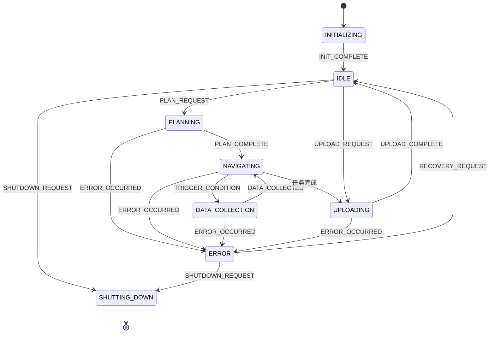

# 状态机使用说明

## 概述

状态机是自动驾驶数据闭环系统中的核心组件，负责协调数据采集和导航规划模块的工作流程。它通过管理系统的不同状态和状态转换，确保整个数据采集任务按预期执行。

## 状态定义

状态机包含以下状态：

1. **INITIALIZING** - 系统初始化中
2. **IDLE** - 空闲状态，等待任务指令
3. **PLANNING** - 路径规划中
4. **NAVIGATING** - 导航中，移动到下一个路径点
5. **DATA_COLLECTION** - 数据采集中
6. **UPLOADING** - 数据上传中
7. **ERROR** - 错误状态
8. **SHUTTING_DOWN** - 系统关闭中

## 事件定义

状态机响应以下事件：

1. **INIT_COMPLETE** - 初始化完成
2. **PLAN_REQUEST** - 请求路径规划
3. **PLAN_COMPLETE** - 路径规划完成
4. **NAVIGATION_START** - 开始导航
5. **WAYPOINT_REACHED** - 到达路径点
6. **TRIGGER_CONDITION** - 触发条件满足
7. **DATA_COLLECTED** - 数据采集完成
8. **UPLOAD_REQUEST** - 请求数据上传
9. **UPLOAD_COMPLETE** - 数据上传完成
10. **ERROR_OCCURRED** - 发生错误
11. **RECOVERY_REQUEST** - 请求恢复
12. **SHUTDOWN_REQUEST** - 请求关闭

## 使用示例

```cpp
// 创建各组件
auto collector = std::make_shared<DataCollectionPlanner>();
auto nav_planner = std::make_shared<NavPlannerNode>();
auto data_storage = std::make_shared<DataStorage>();

// 创建状态机
auto state_machine = std::make_shared<StateMachine>();
state_machine->setDataCollectionPlanner(collector);
state_machine->setNavPlanner(nav_planner);
state_machine->setDataStorage(data_storage);

// 初始化系统
if (!state_machine->initialize()) {
    // 处理初始化失败
    return -1;
}

// 设置任务区域
MissionArea mission(Point(50.0, 50.0), 40.0);
collector->setMissionArea(mission);

// 开始任务规划
state_machine->handleEvent(StateEvent::PLAN_REQUEST);

// 模拟导航过程
for (int i = 0; i < 10; i++) {
    state_machine->handleEvent(StateEvent::WAYPOINT_REACHED);
}
```

## 状态转换图



## 集成要点

1. **组件依赖**：状态机需要数据采集规划器、导航规划器和数据存储器的实例
2. **事件驱动**：整个流程由事件驱动，外部系统通过发送事件来触发状态转换
3. **错误处理**：状态机包含错误状态和恢复机制
4. **日志记录**：所有状态转换都会被记录，便于调试和监控

## 扩展建议

1. 可以添加更多的状态和事件来支持更复杂的任务流程
2. 可以实现状态超时机制，防止系统卡在某个状态
3. 可以添加状态持久化功能，在系统重启后恢复状态
4. 可以实现远程监控接口，实时查看系统状态